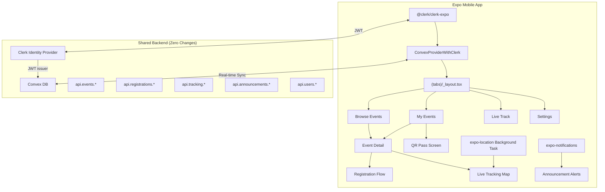

# RaceDay Expo Conversion — Master Plan

> Convert the Next.js web app into a **full-featured Expo (React Native)** mobile app focused entirely on the **runner experience**. Admin and organizer features are excluded.

---

## Conversion Scope

### ✅ Runner Features to Convert

| Web Feature | Source Component | Mobile Screen | Priority |
|---|---|---|---|
| **Authentication** | `useAuth.ts`, Clerk | Login / OAuth | **P0** |
| **Event Discovery** | `EventCard.tsx`, events page | Browse Events tab | **P0** |
| **Event Detail View** | `EventDetailClient.tsx`, `EventHero.tsx`, `EventInfo.tsx`, `EventCategories.tsx`, `EventTimeline.tsx`, `EventRoute.tsx`, `EventAnnouncements.tsx` | Event Detail screen | **P0** |
| **Event Registration** | `RegistrationForm.tsx` (5 steps) | Registration flow (multi-step) | **P0** |
| **My Registered Events** | `RunnerView.tsx`, `RunnerEventCard.tsx` | My Events tab | **P0** |
| **QR Race Pass** | QR pass page | QR Pass screen | **P0** |
| **Live GPS Tracking** | `LiveTrackingClient.tsx`, `RouteMapViewer.tsx` | Live Track screen (background GPS) | **P0** |
| **Announcements** | `EventAnnouncements.tsx`, `RunnerAnnouncements.tsx` | Push notifications + in-app | **P1** |
| **Profile Management** | Settings / profile page | Settings tab | **P1** |
| **Profile Completion** | `ProfileCompletionCard.tsx` | Profile completion card | **P2** |

### ❌ Features NOT Included

- Admin dashboard (user management, audit logs)
- Organizer dashboard (event creation/editing, volunteer management)
- Organizer applications
- Payment processing (Xendit invoice creation)
- Email sending (Resend)
- QR code scanning (volunteer feature)
- Marketing/landing pages
- SEO, sitemap, robots.txt

---

## Tech Stack

| Layer | Choice | Rationale |
|---|---|---|
| **Framework** | Expo SDK 52+ (React Native) | Same TypeScript/React as web, managed workflow, EAS builds |
| **Backend** | Convex (existing — zero changes) | `convex` npm package works in RN; all queries/mutations reused |
| **Auth** | `@clerk/clerk-expo` | Same Clerk instance as web; shared user accounts |
| **Navigation** | Expo Router v4 (file-based) | Mirrors Next.js App Router patterns |
| **Maps** | `react-native-maps` | Native MapView, GPX overlay, runner markers |
| **Background GPS** | `expo-location` + `expo-task-manager` | Tracks when screen is locked — the killer feature |
| **QR Code** | `react-native-qrcode-svg` | Offline QR generation from registration ID |
| **Notifications** | `expo-notifications` | Push for announcements (already wired in Convex) |
| **Images** | `expo-image` (by Expo) | Blazing fast image loading + caching |
| **Icons** | `lucide-react-native` | Same icon set as web app |
| **Fonts** | `expo-font` (Barlow + Barlow Condensed) | Exact same typography as web |
| **Styling** | `react-native-unistyles` or StyleSheet | Native styling with design tokens from web app |

---

## Design System (Matched from Web)

### Colors
```typescript
const colors = {
  primary: "#f97316",     // Orange
  secondary: "#fb923c",   // Light orange
  cta: "#22c55e",         // Green
  background: "#1f2937",  // Dark gray
  surface: "#374151",     // Gray
  text: "#f8fafc",        // Near-white
  textMuted: "#94a3b8",   // Muted gray
  danger: "#ef4444",      // Red
  white: "#ffffff",
  black: "#000000",
};
```

### Typography
```typescript
const fonts = {
  heading: "BarlowCondensed-Bold",    // Font family name after loading
  headingBlack: "BarlowCondensed-Black",
  body: "Barlow-Regular",
  bodyMedium: "Barlow-Medium",
  bodySemiBold: "Barlow-SemiBold",
  bodyBold: "Barlow-Bold",
};
```

### Design Principles (from UI/UX Pro Max)
- **Dark-first**: Dark background (#1f2937) with high-contrast text
- **Sports aesthetic**: Bold, italic, uppercase headings (Barlow Condensed)
- **Orange + Green accents**: Primary for highlights, CTA for actions
- **Card-based layout**: Surface containers with subtle borders
- **Micro-animations**: 150-300ms transitions, haptic feedback
- **Touch targets**: Minimum 44×44pt for all interactive elements

---

## Architecture Diagram



---

## Convex API Reuse Map

Every API endpoint used by the mobile app already exists:

| Mobile Screen | Convex Query/Mutation | File |
|---|---|---|
| Browse Events | `api.events.list` | `convex/events.ts` |
| Event Detail | `api.events.getById` | `convex/events.ts` |
| Registration | `api.registrations.create`, `checkExisting` | `convex/registrations.ts` |
| My Events | `api.registrations.getByUserId` | `convex/registrations.ts` |
| Category Counts | `api.registrations.getCategoryCounts` | `convex/registrations.ts` |
| Announcements | `api.announcements.listByEvent` | `convex/announcements.ts` |
| Live Tracking | `api.tracking.start`, `update`, `stop`, `listByEvent` | `convex/tracking.ts` |
| User Profile | `api.users.current`, `updateProfile`, `syncUser` | `convex/users.ts` |
| Push Token | `api.users.updatePushToken` | `convex/users.ts` |

> [!NOTE]
> The only backend addition needed is an HTTP action for background location updates (background tasks can't use React hooks). This is documented in Stage 4.

---

## Stage Breakdown

| Stage | File | Focus | Effort |
|---|---|---|---|
| 1 | [`stage-1-project-setup.md`](./stage-1-project-setup.md) | Expo project init, Clerk auth, Convex client, design tokens, tab navigation | 1-2 days |
| 2 | [`stage-2-event-discovery.md`](./stage-2-event-discovery.md) | Browse events, event detail, search/filter, announcements | 2-3 days |
| 3 | [`stage-3-registration.md`](./stage-3-registration.md) | Multi-step registration form, payment redirect, my events list | 2-3 days |
| 4 | [`stage-4-live-tracking.md`](./stage-4-live-tracking.md) | Background GPS, live map, GPX route, runner markers, station markers | 3-5 days |
| 5 | [`stage-5-qr-pass-profile.md`](./stage-5-qr-pass-profile.md) | QR pass screen, profile management, profile completion | 1-2 days |
| 6 | [`stage-6-notifications-polish.md`](./stage-6-notifications-polish.md) | Push notifications, haptics, animations, error handling | 1-2 days |
| 7 | [`stage-7-build-release.md`](./stage-7-build-release.md) | EAS Build, app icons, splash, OTA updates, store submission | 1-2 days |
| **Total** | | | **~11-19 days** |

---

## Project Structure

```
raceday-mobile/
├── app/                          # Expo Router (file-based)
│   ├── _layout.tsx               # Root: Clerk + Convex + fonts
│   ├── index.tsx                  # Auth redirect
│   ├── (auth)/
│   │   ├── _layout.tsx
│   │   └── login.tsx
│   ├── (tabs)/
│   │   ├── _layout.tsx           # Tab navigator
│   │   ├── index.tsx             # Browse Events
│   │   ├── my-events.tsx         # My Registered Events
│   │   ├── live.tsx              # Live Track entry
│   │   └── settings.tsx          # Profile & Settings
│   ├── event/
│   │   ├── [id].tsx              # Event Detail
│   │   ├── [id]/register.tsx     # Registration Flow
│   │   └── [id]/live.tsx         # Live Tracking Map
│   └── qr/
│       └── [regId].tsx           # QR Pass Screen
├── components/
│   ├── ui/                       # Shared UI primitives
│   │   ├── Button.tsx
│   │   ├── Badge.tsx
│   │   ├── Card.tsx
│   │   ├── Input.tsx
│   │   ├── Skeleton.tsx
│   │   └── Modal.tsx
│   ├── events/
│   │   ├── EventCard.tsx         # Event list card
│   │   ├── EventHero.tsx         # Detail hero image
│   │   ├── EventInfo.tsx         # Date/location/description
│   │   ├── EventCategories.tsx   # Category cards
│   │   ├── EventTimeline.tsx     # Timeline list
│   │   └── EventAnnouncements.tsx
│   ├── registration/
│   │   ├── StepWho.tsx
│   │   ├── StepCategory.tsx
│   │   ├── StepDetails.tsx
│   │   ├── StepVanity.tsx
│   │   └── StepReview.tsx
│   ├── tracking/
│   │   ├── LiveMap.tsx           # react-native-maps
│   │   ├── TrackerOverlay.tsx    # Runner markers
│   │   └── TrackingControls.tsx  # Start/stop UI
│   └── providers/
│       ├── ClerkProvider.tsx
│       └── ConvexProvider.tsx
├── lib/
│   ├── tokenCache.ts             # Clerk SecureStore
│   ├── hooks/
│   │   ├── useAuth.ts            # Clerk + Convex user
│   │   └── useCurrentUser.ts
│   ├── tracking/
│   │   ├── backgroundTask.ts     # TaskManager definition
│   │   ├── trackingService.ts    # Start/stop helpers
│   │   └── gpxParser.ts          # GPX → coordinates
│   └── utils.ts                  # Shared utilities
├── constants/
│   ├── theme.ts                  # Colors, typography, spacing
│   └── layout.ts                 # Screen dimensions, paddings
├── convex/                       # Symlink → ../raceday-app/convex
├── types/
│   ├── event.ts                  # Shared from web (symlink)
│   ├── registration.ts
│   └── user.ts
├── assets/
│   ├── fonts/                    # Barlow + Barlow Condensed
│   ├── images/
│   │   ├── icon.png              # 1024×1024
│   │   ├── adaptive-icon.png     # Android
│   │   └── splash.png            # 1284×2778
│   └── animations/               # Lottie (optional)
├── app.json                      # Expo config
├── eas.json                      # EAS Build profiles
├── package.json
└── tsconfig.json
```

---

## Key Conversion Differences

| Web (Next.js) | Mobile (Expo) | Notes |
|---|---|---|
| `<Image>` from `next/image` | `<Image>` from `expo-image` | Built-in caching, blurhash |
| `<Link>` from `next/link` | `router.push()` from `expo-router` | Imperative navigation |
| `useRouter()` from `next/navigation` | `useRouter()` from `expo-router` | Same API name, different import |
| Tailwind CSS classes | `StyleSheet.create()` | Design tokens mapped to RN styles |
| `dynamic()` from `next/dynamic` | `React.lazy()` | Code splitting |
| `navigator.geolocation` | `expo-location` (background!) | Core advantage of native app |
| Leaflet `MapContainer` | `react-native-maps` `MapView` | Native maps, much faster |
| `document.getElementById` | `useRef` + RN components | No DOM in RN |
| `localStorage` | `expo-secure-store` / `AsyncStorage` | Secure storage for tokens |
| `window.scrollTo` | `ScrollView.scrollTo` / `FlatList` | Native scroll primitives |
| `IntersectionObserver` | `onViewableItemsChanged` | FlatList viewability |
| CSS `@media` queries | `useWindowDimensions` | Responsive in RN |
| `sonner` toasts | `react-native-toast-message` | Native toast UI |
| `lucide-react` | `lucide-react-native` | Same icons, RN-compatible |
